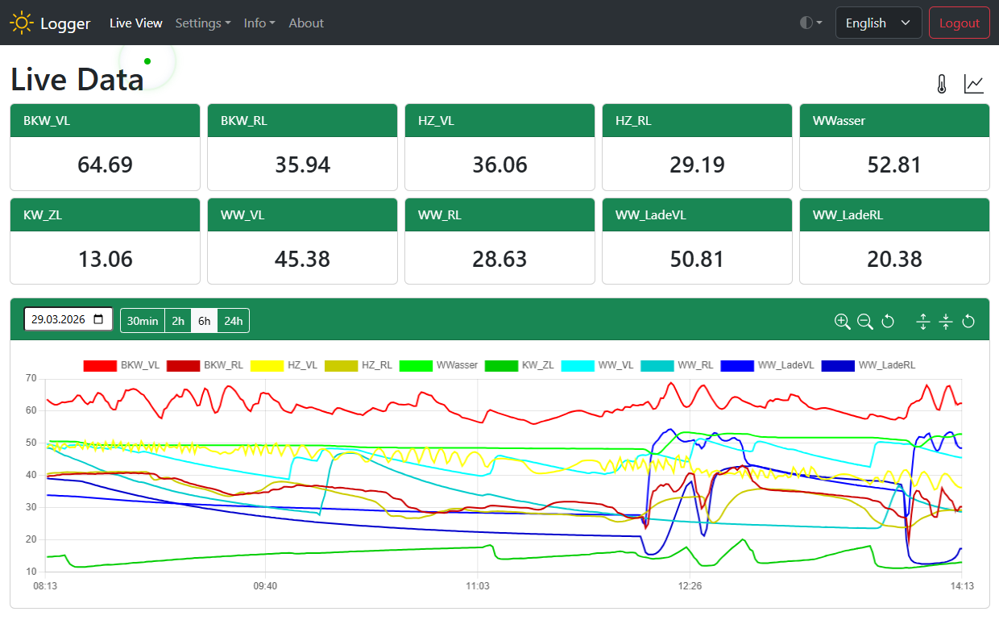
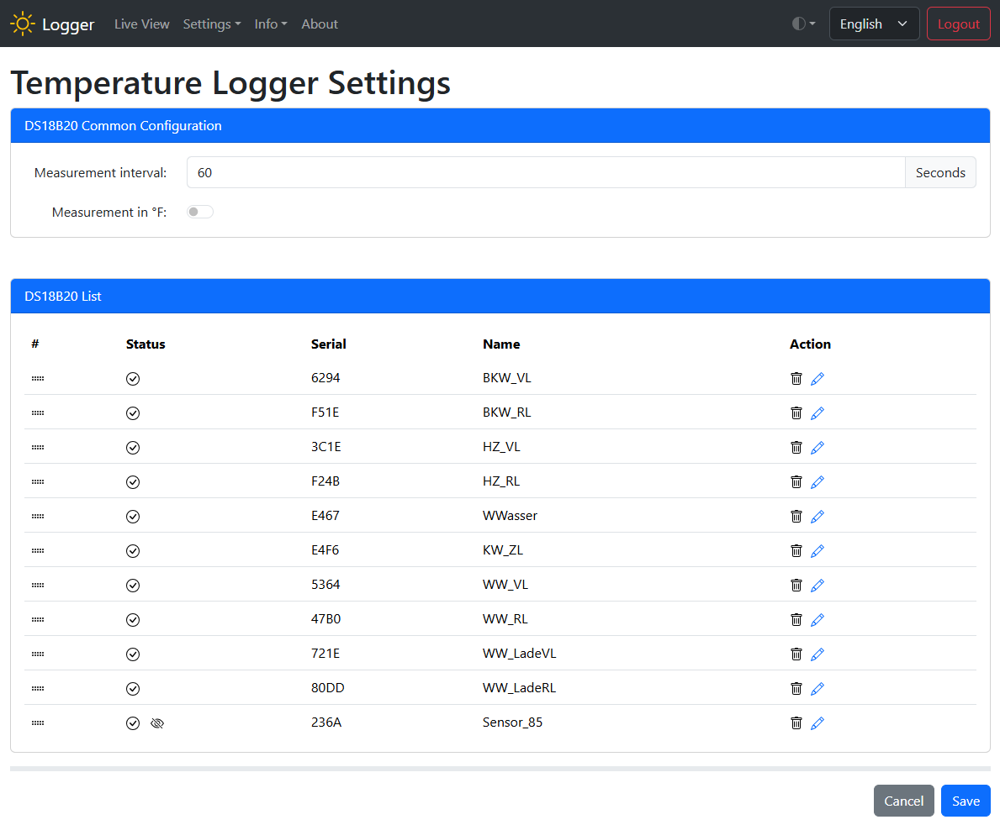

# Temperature Logger

This project is based on OpenDTU. Thank you for that!

The original implementation of the temperature logger (version < 2.0) can be found at <https://www.diy-temperature-logger.com/>. This version here is the further development, which also supports MQTT and (later) other boards. The data is currently written to an SD card. The Android app IoT Sensor Data can also be used with this version. The Hoymiles libraries have been removed and other libraries and the temperature logger functionality have been added. The project is licensed under an Open Source License ( GNU General Public License version 2).

## Overview

Its possible to use the connected DS18B20 temperature sensors for temperature logging.

The DS18B20 sensors are recognized automatically. It is possible to change the names. Sensors that are not connected can be deleted.  It is possible to change the order of the sensors.

**Differences to versions < 2.0:**

- Logging less than 1 minute possible
- MQTT support, Home Assistant Auto Discovery
- Console visible via the app
- Support for other boards can be easily implemented
- OTA
- and many other changes

**Next Features**

- Support other boards: Make display optional and pins configurable
- Support other boards: Make sd card reader optional and pins configurable
- Use internal RAM if no sd card is available (optional)
- Simple trend indiator for temperatures
- Perhaps much later: SVG display of the temperature curve
- Perhaps much later: loading a personal graphic with stickers for the individual temperatures

## Installation

Please have a look at: [Installation](install/README.md)
