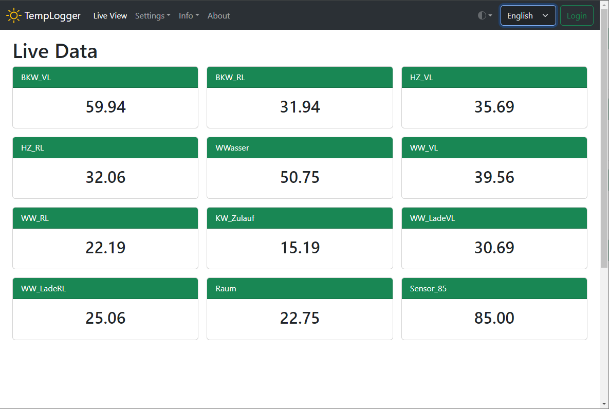
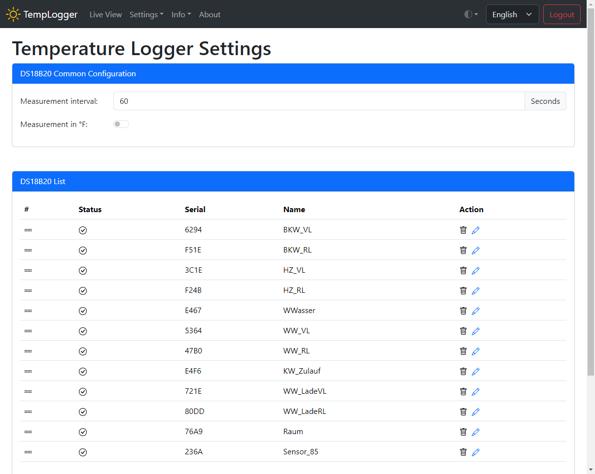

# Temperature Logger

This project is based on OpenDTU. Thank you for that!

There is a project page with more information. <https://www.diy-temperature-logger.com/>

The project is licensed under an Open Source License ( GNU General Public License version 2).

## Overview

- Project for reading out DS18B20 sensors with an ESP32 board
- Up to 5 DS18B20 pins with a total of 30 sensors can be configured
- Support for OLED displays
- MQTT support with Home Assistant Auto Discovery
- Data can be stored on SD cards
- Data can be stored in Ram (4KByte) or PSRam (6MByte). The data will also survive a software board reset. This works very well up to 30 days. Sometimes the data is lost unexpectedly, 
- Pins for sensors, display etc. are configurable
- Online Debug Console
- Compatible with the Android IoT Sensor app with which the temperature history can be displayed.
- Support for ESP32 or ESP32-S3 (an ESP32-S3 chip with PSRAM is recommended)

## Some Picture

The DS18B20 sensors are recognized automatically. It is possible to change the names. Sensors that are not connected can be deleted.  It is possible to change the order of the sensors.

**Next Features**

- Export and import the data
- Improve / bugfix data store in PSRam, maybe with error correction
- Improve the graphical view

## Installation

Please have a look at: [Installation](install/README.md)
