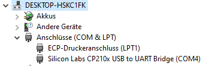
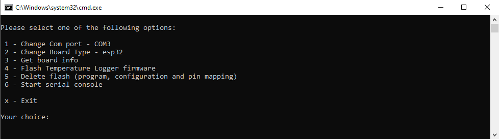

# Install Temperature Logger

There are compiled binaries for an ESP32 and an ESP32-S3 N16R8 board, which has 8MByte PSRam.

Flash.cmd can be used for a completely new installation. The pin mapping must then be configured with a json file. An existing temperature logger can be updated with the menu Settings -> Firmware Upgrade. To do this, the firmware.bin file is needed

## Installation with flash.cmd

1. Download and extract the zip file
2. Install driver for the board UART bridge (CP210x) if neccessary. [https://www.silabs.com/developers/usb-to-uart-bridge-vcp-drivers?tab=downloads](https://www.silabs.com/developers/usb-to-uart-bridge-vcp-drivers?tab=downloads)
   (Remark: For my ESP32 boards its needed, not needed for my ESP32-S3 boards.)


3. Run flash.cmd
4. Change the COM port and the board type and flash the firmware. (On some boards the boot button must be pressed.)



The Delete flash menu item can be useful if the board is in a reboot loop with an incorrect pin mapping.

## Configuration

1. The temperature logger has opened an access point. Connect to that access point.
2. The page http:\\\192.168.4.1 may need to be opened manually in browser.
3. Use admin and openDTU42 as username and password.
4. The router can be entered in the Settings - Network Settings menu.

## Pin Mapping

The pins are configured after flashing a new board.

1. Create pin_mapping.json
2. Open Settings -> Config Management. Choose Pin Mapping and the created pin_mapping.json file. Restore the pin_mapping file.
3. Open Settings -> Device Manager and change Selected Profile. Save the Selected Profile. Reset the board.

pin_mapping.json

```
[
    {
        "name": "ESP32 Oled Wemos Board",
        "display": {
            "type": 2,
            "data": 5,
            "clk": 4,
            "cs": 255,
            "reset": 16
        },
        "sensor": {
            "ds18b20-1": 25
        },
        "sd": {
            "enabled": true,
            "sck": 12,
            "miso": 15,
            "mosi": 13,
            "cs": 14
        }
    },
    {
        "name": "No Display",
        "sensor": {
            "ds18b20-1": 25
        },
        "sd": {
            "enabled": true,
            "sck": 12,
            "miso": 15,
            "mosi": 13,
            "cs": 14
        }
    },
    {
        "name": "ESP32-S3-Pin16-18",
        "sensor": {
            "ds18b20-1": 16,
            "ds18b20-2": 17,
            "ds18b20-3": 18
        }
    }
]

```
